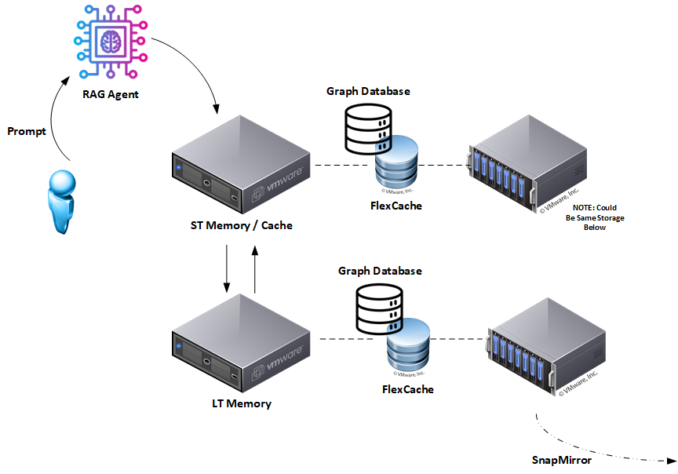

# Graph RAG: Enterprise Version

Retrieval-Augmented Generation (RAG) has emerged as a crucial pattern for grounding large language model (LLM) responses in real-world data, significantly improving accuracy and reliability. However, conventional RAG implementations predominantly rely on vector databases, which inherently grapple with issues such as frequent hallucinations, opaque reasoning paths, and challenges in achieving regulatory compliance.



In response, Graph-based RAG architectures offer substantial improvements by explicitly modeling information through structured relationships within graph databases. This approach transforms data storage from ambiguous embeddings into clearly defined nodes and edges, thereby inherently addressing critical issues such as hallucinations and the lack of explainability found in traditional vector-based systems.

### Key Benefits of Graph-based RAG

- **Transparency and Explainability**: Every query can be explicitly traced through readable, auditable Cypher queries, providing clarity and accountability.
- **Fairness and Bias Mitigation**: Explicitly structured data makes biased correlations easier to detect and rectify.
- **Accountability and Responsibility**: Detailed transaction logging ensures traceable origins of every fact, enhancing reliability.
- **Data Governance and Regulatory Compliance**: Structured relationships simplify adherence to regulatory standards and enhance governance protocols.
- **Risk Management and Safety**: Grounding responses explicitly in structured data dramatically reduces the risk of inaccuracies and hallucinations.

### Dual-Memory Architecture

The proposed Graph-based RAG agent leverages a dual-memory model:

| Memory Type          | Infrastructure                              | Data Stored                    | Purpose                                              |
| -------------------- | ------------------------------------------- | ------------------------------ | ---------------------------------------------------- |
| **Long-term Memory** | Persistent Graph Database                   | Curated, validated data        | Authoritative knowledge repository; compliance-ready |
| **Short-term Cache** | High-performance Graph Storage | Frequently accessed "hot" data | Rapid access for ongoing interactions                |

The integration of Apache Kafka in this enterprise-ready architecture automates seamless synchronization between short-term and long-term memories. Kafka's change-data-capture (CDC) mechanism ensures that validated insights from transient interactions are efficiently promoted into persistent storage, continuously enhancing the quality and accuracy of the long-term knowledge base.

### Business Impact

Implementing Graph-based RAG in an enterprise environment delivers significant strategic advantages:

- **Enhanced operational efficiency**, enabled by low-latency cache interactions leveraging technologies such as NetApp FlexCache.
- **Improved risk management** through precise data tracking and accountability.
- **Superior scalability and resilience**, particularly when paired with advanced storage solutions like NetApp FlexCache and robust disaster recovery via NetApp's SnapMirror.

By adopting this structured, transparent approach, enterprises can not only significantly improve the accuracy and reliability of their AI solutions but also ensure robust governance and compliance.

This document serves as an enterprise-oriented reference guide, laying out a detailed implementation strategy for Graph-based RAG architectures, designed to empower organizations to build faster, clearer, and fully governable AI solutions.

# 2. Ingesting Your Data Into Long‑Term Memory

> **Same core pipeline, enterprise‑grade surroundings.**
> This section mirrors the open source process in [OSS_Community_Version.md](./OSS_Community_Version.md) but incorporates enterprise priorities suck as audit trails, schema governance, and storage economics.

## Why We Start with Clean Knowledge

Long‑term memory is the system's **source of truth**. Anything that lands here must be:

1. **Authoritative** - sourced from validated documents.
2. **Traceable** - every node and relationship carries provenance metadata.
3. **Governance‑ready** - aligned with your organization's taxonomy and compliance requirements.

## Four‑Step Ingestion Pipeline

| Stage                   | What Happens                                                      | Enterprise Add‑Ons                                                              |
| ----------------------- | ----------------------------------------------------------------- | ------------------------------------------------------------------------------- |
| **1. Parse** | Raw content (docs, tickets, PDFs) is loaded.                      | Content hashes recorded for tamper detection.                                   |
| **2. Slice** | Text is split into paragraphs for fine‑grained retrieval.         | Paragraph index stored to preserve original order.                              |
| **3. Extract Entities** | A lightweight NER model (spaCy by default) tags names, orgs, etc. | Model version stamped on each entity for auditability.                          |
| **4. Persist** | Nodes and edges are upserted via `MERGE`.                | Every relationship gets `source`, `ingestedAt`, and `schemaVersion` properties. |

## Reference Code Snapshot *(unchanged from community edition)*

```python
# ingest.py - trimmed
MERGE (d:Document {doc_uuid:$doc_uuid})
SET d.title=$title, d.category=$category
FOREACH (p IN $paragraphs |   
 MERGE (para:Paragraph {para_uuid:p.uuid})
 SET para.index=p.index, para.text=p.text
 MERGE (para)-[:PART_OF]->(d))
```

The community script already ensures idempotency. In an enterprise setting, wrap each batch in a single transaction and tag it with a **batch ID** for easier rollback.

## Operational Knobs You Control

| Variable         | Typical Value          | Why You Might Change It                                          |
| ---------------- | ---------------------- | ---------------------------------------------------------------- |
| `DATA_DIR` | `/mnt/ingest` | Point to NFS, S3‑mount, or SharePoint sync.                      |
| `NER_TYPES` | `PERSON, ORG, PRODUCT` | Narrow scope to reduce noise.                                    |
| `BATCH_SIZE` | `500 docs` | Tune for your disk and network throughput.                       |
| `SCHEMA_VERSION` | `v1.2.0` | Increment when ontology changes; keep old data query‑compatible. |

### Implementation Considerations

The outlined code is a model for a recommendation. It's highly recommended and required to adapt your Ontology (ie, Graph structure, keywords, etc) based on your problem domain.

The use of Named-Entity-Recognition, specifically `spaCy`, is used for demonstration purposes only and to facilitate the discussion. Ideally, how you anchor your keywords to the associations on source data will be determined by your problem domain. In other words, it is probably more advantageous to implement a Named Entity Recognition model based on the keywords you want to identify and act upon. This could be an off-the-shelf code or a model that you train based on the data in your dataset.

## Additional Notes

- *Keep the NER model light.* Heavy transformers slow ingestion; reserve them for query time.
- *Version everything.* Ontology shifts are inevitable—store `schemaVersion` now, thank yourself later.

With clean, well‑labeled data in long‑term memory, every downstream RAG prompt inherits audit‑ready provenance. Next, we'll see how to shuttle hot topics into cache for lightning‑fast responses.

# 3. Promotion of Long‑Term Memory into Short‑Term Cache

> **Goal:** Keep the conversation's working set on storage that feels like RAM without sacrificing provenance or compliance.

## Why Promote?

- **Latency kills UX.** Round‑tripping to a spinning‑disk knowledge graph on every user message drags response time into the seconds.
- **Conversations are sticky.** Users usually stay on the same subject for a while; caching that subject near the LLM eliminates wasted I/O.
- **GPU needs a conveyor belt, not a straw.** Keeping the next batch of paragraphs in a local graph cache keeps the accelerator busy instead of waiting on the database.

## Enterprise Twist vs. Community Guide

| Stage               | Community Edition                       | Enterprise Edition                                                              |
| ------------------- | --------------------------------------- | ------------------------------------------------------------------------------- |
| **Detect entities** | keywords/NER in the app process            | same                                                                            |
| **Fetch sub‑graph** | Direct Cypher query (`PROMOTION_QUERY`) | Identical Cypher, but wrapped in a *Kafka Source Connector* on the long‑term DB |
| **Transfer data** | `MERGE` into short‑term via Bolt        | Kafka CDC event streamed to *Kafka Sink Connector* attached to short‑term DB    |
| **TTL management** | `expiration` property on relationships  | Same property, plus NetApp FlexCache auto‑evicts cold blocks                    |

## Promotion Flow (Enterprise)

1. **Question arrives** — a keywords/NER (example, spaCy) pass yields candidate entities.
2. **Kafka Source Connector** on *long‑term* Neo4j executes `PROMOTION_QUERY` (from `nocache_cypher_query.py`) for those entities and publishes the result set to short-memory which is also our caching mechanism.
3. **Kafka Sink Connector** on *short‑term* Neo4j ingests the topic, `MERGE's nodes/edges, and stamps each relationship with `expiration = timestamp() + TTL_MS`.
4. **LLM retrieves** paragraphs from the high‑speed store; latency drops to sub‑50 ms.
5. **TTL sweeper job** runs hourly, deleting edges whose `expiration` is in the past. Nodes stay for audit, edges vanish for speed.

"`cypher
// PROMOTION_QUERY - executed by Source Connector
MATCH (e:Entity {name:$name})-[:MENTIONS]->(p:Paragraph)
OPTIONAL MATCH (p)-[:PART_OF]->(d:Document)
RETURN e, p, d
```

## Operational Knobs

| Variable                 | Typical                         | Purpose                                            |
| ------------------------ | ------------------------------- | -------------------------------------------------- |
| `TTL_MS` | `3_600_000` (1 h)             | How long cache edges live.                         |
| `CACHE_VOLUME` | NetApp **FlexCache** | Storage backing short‑term DB.                     |
| `KAFKA_TOPIC_THROUGHPUT` | `1000 msg/s` | Throttle to avoid cache stampedes on viral topics. |

### Kafka Connector: the Enterprise Upgrade Path

The community version calls `promote_entity()` from Python. Enterprises need something sturdier—**Neo4j ↔ Kafka Connect in CDC mode**:

1. **Neo4j Source Connector** monitors the **long-term** database for nodes and relationships that match promotion criteria, and streams them to Kafka topics.
2. **Neo4j Sink Connector** consumes those topics and `MERGE's the sub-graph into the **short-term** cache (and vice-versa for reinforcement learning).
3. Kafka buffers every change, guaranteeing *exactly-once* replay even if a DB is offline.

> **Connector snippet**

"`json
{
  "name": "ShortTermNeo4jSource",
  "connector.class": "Neo4jSourceConnector",
  "neo4j.server.uri": "bolt://neo4j-long-term:7688",
  "topic.prefix": "promoted",
  "neo4j.streaming.from ": "now"
}
```

A mirror-image sink pushes the same event into the cache with `MERGE` templates.

### Where to Run the Cache

The backing store you choose for short-term memory determines both raw speed **and** operational flexibility. Here's how the options stack up.

| Option                     | Speed                                                                 | Caveats                                                                                                                                                                                 | Best for                                                      |
| -------------------------- | --------------------------------------------------------------------- | --------------------------------------------------------------------------------------------------------------------------------------------------------------------------------------- | ------------------------------------------------------------- |
| **RAM disk (`tmpfs`)** | 🚀 Fastest (memory-speed reads/writes)                                | Limited by host RAM; cache evaporates if the pod restarts or the node reboots                                                                                                           | Laptop demos, single-node PoCs                                |
| **Local NVMe SSD** | ⚡ Near-memory throughput once page cache is warm                      | Volume is tied to the node; Kubernetes can't reschedule the Neo4j pod without data migration headaches                                                                                  | Bare-metal servers, on-prem clusters with fixed node affinity |
| **ONTAP FlexCache volume** | ⚡ Micro-second reads (served from cache) with petabyte-scale capacity | Requires NetApp ONTAP backend, gains seamless portability; any pod on any node can mount the same cached dataset, making rescheduling trivial and multi-AZ clusters straightforward  | Production Kubernetes, multi-site or bursty workloads         |

**Why FlexCache Wins for Enterprises**

- **Elastic capacity** - Scale the cache well beyond physical RAM without requiring changes to YAML.
- **Portability** - The volume follows your pod; StatefulSets can fail over to a fresh node and keep the cache warm.
- **Centralised governance** - SnapMirror and ONTAP thin provisioning add replication and cost control without extra plumbing.

In short, RAM disks and NVMe get you speed, but FlexCache delivers speed **plus** the operational freedom enterprises expect. If your cluster already runs ONTAP, it's the clear upgrade path for short-term graph storage.

# 4. Provides Reinforcement Learning and Data Promotion

> **Goal:** Let the cache teach the graph which facts deserve permanence—no cron jobs, no manual curation.

## Why a Feedback Loop?

- **Fresh context ages fast.** News articles, support tickets, and sensor feeds hit short‑term memory minutes after they drop. Most expire quietly; a few become corporate lore.
- **Humans validate, models reuse.** Each time a paragraph answers a question—or a subject‑matter expert gives a thumbs‑up—its confidence climbs.
- **Promote only the proven.** When a fact's score crosses a threshold, it graduates to long‑term memory automatically.

## Enterprise Twist vs. Community Guide

| Stage                 | Community Edition (`promote.py`)                | Enterprise Edition (Kafka CDC)                                                  |
| --------------------- | ----------------------------------------------- | ------------------------------------------------------------------------------- |
| **Score hits** | Counter stored on relationship                  | Same                                                                            |
| **Cross threshold** | Python script copies sub‑graph via dual drivers | Add `:Validated` label; CDC event moves data via Kafka Source → Sink Connectors |
| **Remove expiration** | Script clears `expiration` field                | Sink Connector Cypher strips `expiration` during merge                          |
| **Audit trail** | Print to stdout                                 | Kafka topic persisted + Neo4j tx logs                                           |

## Promotion Workflow (Enterprise)

1. **New fact arrives** — ingested into short‑term graph with `confidence_score = 1`, `expiration = now() + TTL_MS`.
2. **Cache hit or SME validation** — a trigger increments `confidence_score` (e.g., `+1` per hit, `+10` per manual confirm).
3. **Threshold reached** — when `confidence_score ≥ PROMOTE_THRESHOLD`, the app flags the root node or relationship with `:Validated`.
4. **Kafka Source Connector** on the *short‑term* DB streams the CDC event to topic `validated.*`.
5. **Kafka Sink Connector** on the *long‑term* DB consumes the topic and `MERGE`s the sub‑graph **without** the `expiration` property, setting `promoted = true` for traceability.
6. **Confirmation log** — both connectors write offsets and Neo4j tx IDs for audit.

"`cypher
// Increment score on hit
MATCH (p:Paragraph {para_uuid:$uuid})-[r:MENTIONS]-()
SET r.confidence_score = coalesce(r.confidence_score,0) + $weight
WITH r, r.confidence_score AS score
WHERE score >= $PROMOTE_THRESHOLD
SET r:Validated;
```

## Operational Knobs

| Variable            | Default      | Purpose                                           |
| ------------------- | ------------ | ------------------------------------------------- |
| `HIT_WEIGHT` | `1` | Increment for automatic reuse in answers          |
| `VALIDATION_WEIGHT` | `10` | Increment for explicit human approval             |
| `PROMOTE_THRESHOLD` | `25` | Score needed to graduate to long‑term             |
| `TTL_MS` | `3_600_000` | Keeps unproven facts from polluting cache forever |

### Kafka Connector Cypher Snippet *(Sink → Long‑Term)*

"`json
{
  "name": "LongTermNeo4jSink",
  "connector.class": "Neo4jSinkConnector",
  "topics": "validated.nodes,validated.rels",
  "neo4j.topic. Cypher.validated.nodes ": "MERGE (n:Entity {uuid:event.id}) SET n += event.properties REMOVE n.expiration SET n.promoted=true",
  "neo4j.topic. Cypher.validated.rels": "MERGE (a {uuid:event.start.id}) MERGE (b {uuid:event.end.id}) MERGE (a)-[r:MENTIONS]->(b) SET r += event.properties REMOVE r.expiration SET r.promoted=true"
}
```

*Note:* Removing `expiration` during the merge is the magic moment a short‑term fact becomes long‑term.

## Governance & Safety Wins

- **Traceable promotions** — every CDC event carries tx metadata; auditors can replay the exact moment a fact was promoted.
- **Bias visibility** — because each promotion records `sourceFeed`, analysts can see if one content stream dominates the graph.
- **Instant rollback** — flip `promoted = false`, re‑emit a CDC tombstone, and the sink connector deletes the long‑term copy while leaving the short‑term record intact.

Short‑term memory now acts as an always‑on incubator: good facts rise, bad facts fade, and governance stays on autopilot. Next, we'll wrap the paper with a concise Conclusion and call to action.

## 5. Implementation Guide

For a reference, please check out the following: [enterprise_version/README.md](./enterprise_version/README.md)

# 6. Conclusion

Graph‑based RAG turns retrieval‑augmented generation from a clever hack into a governed, production‑ready pattern. By storing knowledge as explicit nodes and relationships—and placing hot data on high‑speed media—you get answers that are:

- **Faster.** Sub‑50 ms round‑trips keep the UX snappy and GPUs saturated.
- **Clearer.** Every fact is traceable through Cypher; auditors can walk the same path the LLM used.
- **Safer.** Bias hot‑spots, stale data, and hallucination risks surface as first‑class graph objects you can inspect and fix.
- **Compliant.** Built‑in provenance and data‑retention controls satisfy governance teams without bolted‑on tooling.

The enterprise extensions—Kafka CDC pipelines, NetApp FlexCache, SnapMirror, and thin provisioning—bring the operational muscle needed for 24/7 workloads and multi-site resiliency.

## Next Steps

1. **Clone the repo.** The outlined code and docs live at `github.com/your‑org/graph‑rag‑guide`. Kick the tires locally with Docker Compose.
2. **Swap in your graph engine.** All queries use plain Cypher; if you prefer NebulaGraph or Amazon Neptune, change the driver string and go.
3. **Feed it live data.** Point the ingest pipeline at a news feed, Jira export, or API dump to see short‑term memory light up.
4. **Tune the thresholds.** Adjust `HIT_WEIGHT`, `PROMOTE_THRESHOLD`, and `TTL_MS` until promotions align with your domain's truthiness bar.
5. **Share lessons.** Open issues, file pull requests, or post a case study. The community guide thrives on real‑world feedback.

Graph‑based RAG isn't theoretical anymore—it's running code with governance baked in. Bring it into your stack and build AI you can trust.
