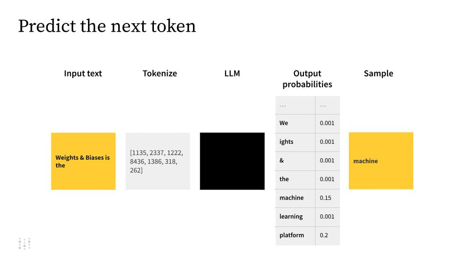
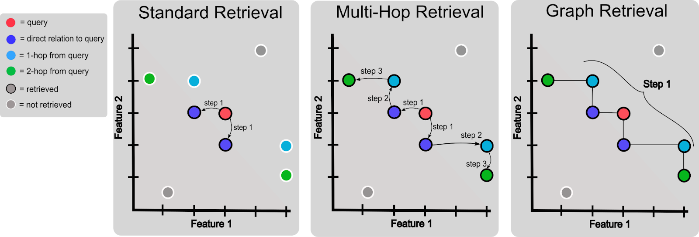
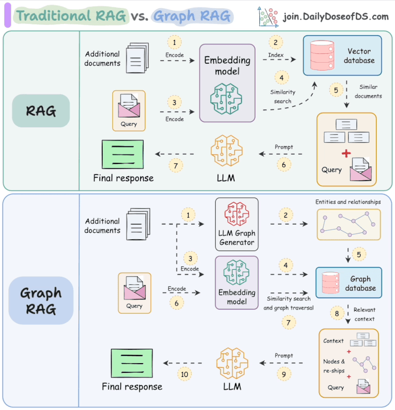

# **Knowledge Graphs for Better AI Governance**

## **1. Executive Summary**

Retrieval-Augmented Generation (RAG) is rapidly becoming essential for developing intelligent applications that produce accurate and reliable outputs. Traditionally, RAG systems rely heavily on vector databases, which, despite their speed and effectiveness, can suffer from issues such as hallucinations and offer limited explainability. A graph-based approach to RAG addresses these critical issues head-on, significantly enhancing accuracy, transparency, and compliance with AI governance standards.

This white paper introduces a graph-based RAG architecture that utilizes **Graph Database** as the foundational technology for managing short- and long-term memory storage. By leveraging knowledge graphs, the system ensures that the retrieved context for generating responses is not only semantically relevant but also inherently structured. Unlike traditional vector methods, graph-based RAG inherently supports transparency and traceability due to the explicit relationships and properties within the graph database. Consequently, it provides improved explainability, reduced hallucinations, and better regulatory compliance.

Key benefits of adopting graph-based RAG include:

- **Transparency and Explainability**: Direct visibility into the reasoning process through structured relationships in the knowledge graph.

- **Fairness and Bias Mitigation**: Easier identification and adjustment of biased data due to explicit data structures.

- **Accountability and Responsibility**: Enhanced traceability with detailed transaction logging.

- **Data Governance and Regulatory Compliance**: Simplified compliance and data governance practices thanks to clear data lineage and structure.

- **Risk Management and Safety**: Reduction of erroneous outputs, thereby lowering operational risk.

The target audience for this implementation ranges from open-source engineers looking for reliable RAG alternatives to enterprise architects focused on scalability and compliance, to NetApp customers seeking to leverage infrastructure for improved AI performance. Accompanying this white paper is a detailed, open-source reference implementation, complete with comprehensive documentation enabling practitioners to directly explore and adopt this enhanced RAG solution.

Ultimately, this paper encourages immediate engagement with the graph-based RAG approach, promoting a community-driven evolution towards safer, clearer, and more accountable AI.

## **2. Introduction to Retrieval-Augmented Generation (RAG)**

Retrieval-Augmented Generation (RAG) is a technique that enhances the capabilities of generative AI models by pairing them with a retrieval system. Traditional Large Language Models (LLMs), despite their impressive abilities, often produce incorrect or misleading information, commonly referred to as "hallucinations", because they generate responses based solely on internal learned patterns. RAG addresses this issue by grounding LLM outputs in verified external knowledge, ensuring more accurate and reliable responses.

Typically, RAG systems work by fetching relevant pieces of information from a large data store based on user queries. These retrieved data points are then provided as context to the generative model. By doing so, the model's output is directly influenced by authoritative external sources rather than solely by probabilistic token predictions.

While many existing RAG implementations rely on **Vector Databases**, which use semantic embedding similarity to retrieve data, this approach has notable limitations. Vector databases effectively capture the semantic meaning of unstructured data such as text, images, and audio, making them useful for highly scalable, low-latency retrievals. However, they treat knowledge as flat and lack the capacity to represent complex relationships between entities. Because of this, vector-based RAG systems can struggle with multi-step reasoning tasks and fail to accurately represent nuanced relationships inherent in structured data.

In contrast, **Graph-based RAG** leverages knowledge graphs, which naturally represent data as nodes (entities or concepts) connected by edges (relationships). Graph databases such as Neo4j or NebulaGraph provide structured storage and retrieval, preserving and utilizing intricate relationships within data. This approach significantly reduces hallucinations by ensuring that responses are derived from interconnected, validated facts rather than isolated snippets of context. Furthermore, Graph-based RAG supports multi-hop reasoning, which involves navigating through interconnected data points to retrieve comprehensive and contextually rich information.

A key advantage of graph-based RAG is its inherent transparency. Unlike vector embeddings, which are opaque and difficult to interpret directly, knowledge graphs can be visualized and understood intuitively, allowing clear insights into why specific information was retrieved. This transparency not only supports explainability and trust but also facilitates bias detection and governance, which is an important consideration in responsible AI deployments.

In summary, while traditional vector-based RAG excels in handling vast amounts of unstructured data efficiently, Graph-based RAG emerges as a superior choice when structured relationships, accuracy, transparency, and explainability are essential. The following sections will explore in depth how leveraging knowledge graphs within RAG architectures can yield substantial benefits for AI governance, reliability, and user trust.

## **3. Graph-Based RAG Architecture**

### **High-Level Architecture Description**

Graph-based Retrieval-Augmented Generation (RAG) architectures fundamentally differ from traditional vector-based approaches by explicitly encoding and utilizing structured relationships within data. At its core, a Graph-based RAG system consists of three major components:

1. **Large Language Model (LLM)**: Generates responses and formulates structured queries (typically Cypher queries).

2. **Graph Database**: Stores data as interconnected nodes and relationships, providing structured knowledge retrieval.

3. **Middleware or Integration Layer**: Facilitates communication between the LLM and the graph database, executing queries, caching results, and managing data flow.

Unlike vector databases, which represent knowledge as isolated high-dimensional embeddings, graph databases structure data as explicit entities and clearly defined relationships, enabling multi-hop reasoning and nuanced contextual understanding. This fundamental architectural decision significantly enhances retrieval accuracy, reduces hallucinations, and promotes transparency and explainability.

### **Short-Term vs. Long-Term Memory Roles**

A distinctive feature of a Graph-based RAG architecture is its explicit support for two distinct memory mechanisms: **short-term** and **long-term memory**:

- **Short-Term Memory**: Captures transient data and context relevant only within a limited timeframe (e.g., the duration of a conversation, query session, or timed interval). In practical terms, short-term memory is often implemented using graph edges marked with timestamps indicating their expiration. For example, relationships (MENTIONS) connecting entities and documents may carry an expiration timestamp set shortly after creation (e.g., 1 hour). This memory is ephemeral by design, optimized for rapid insertion and retrieval to support real-time interactions.

- **Long-Term Memory**: Stores permanent or semi-permanent knowledge, ensuring persistence beyond individual sessions. Transitioning data from short-term to long-term memory involves simply removing the expiration timestamp from graph relationships, promoting ephemeral knowledge to durable storage. Long-term memory thus acts as the authoritative knowledge repository, accumulating validated, stable facts for future retrieval and inference.

### **Benefits of Knowledge Graphs**

Graph databases such as Neo4j or NebulaGraph deliver distinct advantages by modeling knowledge explicitly:

- **Structured Knowledge Representation**: Relationships between entities are explicitly encoded, offering immediate clarity regarding how entities relate to each other. This explicit structure simplifies complex reasoning tasks and enhances retrieval precision.

- **Multi-Hop Reasoning**: Graph retrieval naturally facilitates complex queries involving multiple related entities, such as finding indirect connections through several "hops," a task notoriously challenging for vector databases.

- **Transparency and Interpretability**: The structure and relationships in graph databases can be visually inspected and understood intuitively, significantly improving transparency and user trust compared to opaque embedding-based retrievals.

- **Reduction of Hallucinations**: Directly querying verified structured data reduces the likelihood of generating incorrect or misleading information. By grounding responses in authoritative relationships, Graph-based RAG architectures inherently limit the "guesswork" typical in LLM-driven generation processes.

### **Enhancing Transparency and Explainability**

A notable advantage of graph-based architectures is their inherent explainability, essential for AI governance and compliance:

- **Explicit Data Paths**: Each retrieval operation corresponds to explicit paths in the graph database, making it straightforward to trace and explain why particular data was retrieved in response to a query. Visualizing these relationships can help non-technical stakeholders easily understand AI decision-making processes.

- **Improved Auditability and Compliance**: The explicit nature of knowledge graphs means all interactions (i.e., queries, insertions, and updates) can be logged transparently, supporting robust data governance, accountability, and regulatory compliance. Changes to the graph are easy to monitor and audit, providing comprehensive data provenance and ensuring AI systems meet rigorous governance standards.

- **Bias Mitigation**: Explicit relationships and structured data make it easier to detect, interpret, and correct biases. Unlike opaque embeddings, knowledge graphs allow direct manipulation and oversight of how data is represented and interconnected, simplifying fairness evaluations and interventions.

### **Visualizing the Architecture (Referencing Diagram)**

To conceptualize this clearly, consider the diagram on page 10 of the provided materials. It compares traditional vector-based RAG architectures with Graph-based RAG systems. Vector-based architectures rely on semantic embedding models, generating and retrieving flat embeddings from vector databases. In contrast, the Graph-based RAG model clearly outlines how queries and responses flow through structured data representations, enabling explicit data lookups, and structured knowledge generation paths.

By harnessing the explicit relational structure and transparency of knowledge graphs, this Graph-based RAG architecture sets the stage for highly reliable, transparent, and governance-friendly AI applications. The next sections will delve into the specific implementations and operational considerations of short-term and long-term memory within this powerful architectural framework.

## **4. Short-Term Memory**

### **Overview of Short-Term Memory**

In a Graph-based Retrieval-Augmented Generation (RAG) architecture, short-term memory serves a dual purpose: it temporarily holds new information for immediate use, and it acts as a caching mechanism to speed up frequent queries. This approach optimizes both the responsiveness and relevance of interactions, especially critical for real-time applications and interactive AI systems.

Short-term memory in a graph database is explicitly structured using nodes and relationships, enriched with additional metadata such as timestamps or expiration dates. These markers help define the lifetime of each memory, automatically ensuring outdated or ephemeral information doesn't clutter the system over time.

### **Implementation Details from Research**

A practical short-term memory implementation in a Graph-based RAG system involves clearly defined data modeling practices:

- **Nodes and Relationships**: Short-term facts are represented as nodes (entities and documents), connected by relationships such as MENTIONS. These relationships are enhanced with metadata, specifically, an expiration property set at the time of insertion.

- **Expiration Mechanism**: When new data enters the system, relationships receive an expiration timestamp, typically set to expire after a defined interval, such as 1 hour. Queries designed to access short-term memory explicitly check this timestamp, ensuring only currently valid facts are retrieved. Once the expiration timestamp passes, the relationship becomes invisible to subsequent queries, effectively "forgetting" the ephemeral data without explicit manual deletion.

- **Promotion to Long-Term**: Important short-term facts that warrant permanent retention are promoted to long-term memory simply by removing the expiration timestamp. This streamlined method simplifies the process of transitioning crucial short-term insights into durable knowledge.

- **Forced Expiration**: Occasionally, immediate removal of short-term memory is required. Administrators can forcibly expire relationships by setting their expiration date to a time already past, instantly removing those facts from active queries without physically deleting nodes or relationships. This maintains historical integrity while keeping active memory clean and efficient.

### **Performance Considerations and Optimization**

Implementing short-term memory within a graph-based architecture requires careful consideration to ensure performance efficiency, especially under high concurrency or enterprise-scale scenarios:

- **Caching Strategies**: Utilizing in-memory caches or RAM-based storage (like tmpfs) can dramatically improve query performance. This ensures low-latency access to frequently requested data, essential in interactive and real-time applications. Benchmark studies indicate that in-memory solutions can offer substantially lower latency compared to disk-based solutions, but with the trade-off of volatility.

- **Indexing and Query Optimization**: Effective indexing of frequently accessed nodes and relationships significantly reduces retrieval times. Neo4j supports various indexing techniques, such as full-text indexing for quick lookups and composite indexing to speed up combined-property queries. Leveraging these capabilities ensures short-term memory operations remain highly responsive under load.

- **Efficient Data Transitioning**: The efficiency of transferring data between short-term and long-term storage greatly impacts overall system responsiveness. Techniques such as Neo4j's Kafka Connector operating in Change Data Capture (CDC) mode can be employed to synchronize changes efficiently between short-term and long-term databases. This provides real-time replication without compromising performance.

- **Regular Maintenance**: Periodic cleanup procedures to remove expired relationships help prevent performance degradation over time. Automating these routines ensures sustained high performance and optimal use of system resources, minimizing the overhead introduced by data accumulation.

### **Benefits of Short-Term Memory**

The structured approach to short-term memory provides several practical benefits:

- **Real-Time Responsiveness**: Enables immediate recall of recently acquired information, critical for interactive AI applications and customer-facing chatbots.

- **Efficient Resource Utilization**: Automatically expires ephemeral data, maintaining system efficiency and reducing unnecessary storage usage.

- **Improved Explainability**: Clearly structured temporary data facilitates easier debugging, tracing, and explanation of AI-driven decisions.

- **Simplified Data Management**: Automatic data expiration combined with seamless transition methods for long-term retention simplifies ongoing data governance tasks.

Short-term memory, as implemented through graph databases, thus acts as a dynamic and responsive component within Graph-based RAG architectures, balancing rapid interaction with robust governance. Next, we'll explore the role and structure of long-term memory, illustrating how it complements short-term mechanisms to ensure durable and reliable knowledge management.

## **5. Long-Term Memory**

### **Overview of Long-Term Memory**

Long-term memory is the persistent knowledge foundation of a Graph-based Retrieval-Augmented Generation (RAG) architecture. Unlike short-term memory, which handles ephemeral and rapidly changing information, long-term memory retains stable, validated knowledge indefinitely. It acts as the authoritative, reliable repository from which RAG agents retrieve historical, contextual, and permanently relevant information. Structurally represented within a graph database such as Neo4j, long-term memory ensures consistency, auditability, and accuracy across all operations and inferences.

**Structure of a Typical Graph Database**

Long-term memory in graph databases leverages the core capabilities of nodes and relationships, combined with permanent metadata annotations:

- **Persistent Nodes and Relationships**:  
  Nodes represent distinct entities (e.g., people, locations, concepts), while relationships depict stable associations between these entities. Unlike short-term relationships, these are not marked for expiration, making them permanent by default. This straightforward difference simplifies data governance and clearly delineates stable, authoritative information from temporary context.

- **Metadata Enrichment**:  
  Nodes and relationships in long-term memory frequently include descriptive metadata attributes, such as timestamps of original insertion, source provenance, or confidence levels, to enhance auditability and governance. This explicit metadata simplifies regulatory compliance and facilitates thorough tracing of AI-generated responses back to their source knowledge.

- **Semantic Integrity**:  
  Long-term memory databases often employ standardized ontologies or consistent schemas to ensure semantic integrity. Maintaining clear and explicit schema definitions makes reasoning over complex relationships more reliable, improving retrieval accuracy and reducing misinterpretations or hallucinations.

### **Integration with Short-Term Memory**

A critical feature of Graph-based RAG is the seamless transition between short-term and long-term memory. This transition typically involves straightforward metadata manipulation rather than complex migration processes:

- **Promotion of Short-Term Data**:  
   Data deemed valuable for long-term retention, such as crucial customer interactions, validated insights, or stable business knowledge, can easily transition to permanent storage. For example, this promotion process involves simply removing the expiration metadata from short-term relationships. Such simplicity streamlines long-term knowledge accumulation, providing frictionless integration between ephemeral and stable data.

- **Real-Time Synchronization**:  
  Enterprise deployments often leverage technologies, such Kafka or Spark Connectors, to continuously synchronize short-term changes into long-term repositories. This near-real-time integration ensures that valuable ephemeral insights are promptly and efficiently preserved without manual intervention or delayed batch processing.

- **Controlled Data Expiration and Archiving**:  
  Conversely, to manage storage resources and performance, long-term databases periodically archive outdated or superseded data. This archival process involves selectively exporting historical relationships to external storage (like object storage systems or backup repositories) for potential future auditing, compliance reviews, or historical analysis.

### **Performance and Scalability Considerations**

Long-term memory systems require careful consideration of performance optimization and scalability to ensure continued efficiency as data volumes grow:

- **Efficient Querying**:  
  Effective use of indexing (e.g., full-text, composite, and spatial indexes) helps maintain rapid retrieval speeds even with extensive datasets. Optimized Cypher queries ensure rapid multi-hop reasoning across complex relationship networks, supporting high concurrency workloads typical of large-scale enterprise environments.

- **Resource Management**:  
  Adequate allocation of hardware resources, such as NVMe-based storage solutions combined with significant RAM allocations, ensures that frequently queried long-term data remains cached in memory, reducing retrieval latency. Benchmark studies indicate NVMe-backed deployments strike an effective balance between low-latency performance and persistent durability, essential for enterprise-scale long-term storage.

- **Robust Backup and Recovery**:  
  Regular backups and robust recovery protocols ensure data persistence and compliance with enterprise reliability requirements. Automated backup tools (for example, Neo4j's built-in `neo4j-admin backup`) offer continuous or incremental backups, facilitating rapid recovery in case of system failures or data corruption events.

### **Governance and Compliance Advantages**

Long-term memory inherently aligns with robust governance frameworks due to its structured, transparent, and audit-friendly nature:

- **Transparency and Explainability**:  
  Explicitly structured data facilitates clear explanations of AI-driven decisions. Analysts and regulators can readily inspect the stored knowledge, tracing AI responses back through explicit graph relationships to original source materials.

- **Auditability**:  
  The persistent and structured nature of graph data allows for comprehensive provenance tracking, ensuring each piece of information can be traced from its insertion through every interaction, query, and retrieval. This facilitates regulatory compliance with data privacy and governance requirements such as GDPR and other regional standards.

- **Bias and Fairness Mitigation**:  
   Explicitly stored knowledge makes bias detection and correction significantly easier compared to opaque vector embeddings. Auditors and developers can identify biased relationships directly within the graph and correct them proactively, supporting fair and unbiased AI decision-making.

Long-term memory thus anchors Graph-based RAG systems, providing durable, reliable, and explainable knowledge storage essential for robust, compliant, and high-quality AI solutions. In the next section, we'll explore in detail the improvements in AI governance that Graph-based RAG architectures deliver.

## **6. AI Governance Improvements**

Effective AI governance ensures that artificial intelligence systems operate transparently, fairly, and responsibly. Graph-based Retrieval-Augmented Generation (RAG) architectures significantly advance AI governance capabilities by explicitly structuring knowledge, enhancing transparency, and facilitating accountable decision-making. This section outlines how Graph-based RAG directly addresses essential governance areas: transparency and explainability, fairness and bias mitigation, accountability and responsibility, data governance, regulatory compliance and standards, and risk management and safety.

### **Transparency and Explainability**

Graph-based RAG inherently boosts transparency by clearly representing data as explicit nodes (entities) and relationships (associations). This explicit structure allows easy tracing of how and why data was retrieved, facilitating straightforward explanations of AI-driven outcomes. Unlike vector-based methods, which rely on opaque embeddings, knowledge graphs provide a direct, human-readable context, simplifying the explanation of complex AI decisions to stakeholders and regulators. Visualizing explicit graph paths helps users intuitively grasp the reasoning behind responses, significantly increasing trust and adoption in enterprise environments.

### **Fairness and Bias Mitigation**

Bias detection and mitigation become simpler within graph-based systems because data and relationships are explicitly defined. Graph databases offer the ability to identify biased patterns or imbalanced associations directly. For instance, disproportionate connections between specific entities can be quickly recognized and corrected within a graph structure. Unlike black-box embeddings, where biases are hidden and difficult to address, graphs allow developers and auditors direct access and control to proactively manage fairness, thus significantly reducing potential harm from biased AI-driven decisions.

### **Accountability and Responsibility**

Accountability within AI systems hinges on the ability to audit data usage, trace decision-making processes, and verify outcomes. The explicit and structured nature of knowledge graphs inherently facilitates comprehensive data provenance and audit trails. Every interaction—from data insertion, retrieval, updates, to promotions from short-term to long-term memory—is recorded explicitly in the graph structure or transaction logs. This clarity of operations ensures that accountability remains consistently high, providing tangible evidence during audits or regulatory reviews. Such robust traceability encourages responsible AI deployment and usage throughout an organization.

### **Data Governance**

Graph-based RAG architectures significantly simplify the management and oversight of data. Explicit metadata, timestamps, expiration mechanisms, and clear transition pathways from short-term to long-term storage provide powerful tools for maintaining data quality and compliance. Data stewards can enforce governance policies more effectively, precisely controlling data lifecycles, enforcing retention and deletion policies, and quickly identifying data lineage. These capabilities ensure alignment with enterprise-wide governance strategies and facilitate clear, standardized data handling practices across all organizational units.

### **Regulatory Compliance and Standards**

Compliance with data privacy and regulatory standards, such as GDPR, HIPAA, and other region-specific requirements, is greatly enhanced by the structured nature of knowledge graphs. Graph-based architectures allow for precise management of data access, use, and retention policies. The explicit tracking of data origins, combined with comprehensive metadata annotations, simplifies regulatory reporting and demonstrates compliance with legal standards. Additionally, structured storage aligns naturally with enterprise data standards and frameworks, making regulatory audits smoother and less resource-intensive.

### **Risk Management and Safety**

Graph-based RAG reduces operational and reputational risk by minimizing hallucinations and inaccuracies, common pitfalls of purely probabilistic token-based generation models. By grounding generation processes explicitly within structured and verifiable external knowledge, responses become reliably accurate and contextually valid. The ability to control short-term data expiry further mitigates risk, ensuring outdated or sensitive information is promptly managed and securely handled. This enhanced reliability significantly reduces organizational risk exposure, fostering safer and more dependable AI interactions.

### **Summary of Governance Improvements**

By employing structured, transparent, and explicit knowledge management techniques, Graph-based RAG architectures provide substantial governance improvements over traditional methods:

- **Enhanced Explainability**: Easy-to-follow data paths clarify AI decisions.

- **Proactive Fairness**: Explicit bias detection and correction mechanisms.

- **Comprehensive Accountability**: Robust data provenance and auditing capability.

- **Simplified Data Oversight**: Clear governance through structured management.

- **Streamlined Compliance**: Facilitated adherence to regulatory standards.

- **Improved Risk Control**: Reduction of inaccuracies and operational vulnerabilities.

Graph-based RAG thus emerges as a robust, governance-aligned solution, ensuring AI systems are not only performant but also responsible, accountable, and aligned with modern governance best practices. Next, we'll explore the specific use cases and target audiences best suited for deploying this sophisticated and governance-friendly AI architecture.

## **7. Target Audience and Use Cases**

Graph-based Retrieval-Augmented Generation (RAG) architectures are particularly valuable for stakeholders who require robust, transparent, and scalable AI solutions. The explicit structure of knowledge graphs significantly enhances system clarity, governance, and trust. Here, we explore the primary audiences for this reference implementation, along with representative use cases tailored to each group's unique needs and goals.

### **Open-Source Engineers**

Open-source engineers actively seek robust yet flexible architectures they can easily adapt and extend. A graph-based RAG implementation provides precisely this flexibility through:

- **Community-Driven Enhancements**:  
  Graph databases such as Neo4j and NebulaGraph enjoy extensive open-source communities. Engineers can readily contribute plugins, optimizations, and extensions, rapidly iterating and innovating beyond initial capabilities.

- **Extensible Data Modeling**:  
  Open-source engineers benefit from the clarity and adaptability of explicit data models. Clearly defined nodes and relationships allow for easy schema evolution, facilitating community-driven standards for various applications such as conversational AI, content management, and semantic search.

- **Use Case Example**:  
  An open-source community developing a conversational AI chatbot can use this Graph-based RAG architecture to collaboratively build a knowledge repository. Contributors can continuously add new dialogue paths, enhance relationship structures, and improve response accuracy and explainability, collectively refining AI interactions.

### **Enterprise Architects**

Enterprise architects demand AI solutions that align with stringent requirements around compliance, transparency, and scalability. Graph-based RAG delivers distinct advantages in these critical areas:

- **Governance and Compliance**:  
  The transparency and structured nature of knowledge graphs naturally supports compliance with strict regulatory standards (such as GDPR, HIPAA, or financial regulations). Provenance tracking and explicit data paths simplify auditability and ensure accountability.

- **Scalable Infrastructure**:  
  Enterprise-scale graph solutions can readily scale horizontally and vertically, leveraging high-performance storage solutions (such as NVMe SSDs) and advanced caching mechanisms to maintain responsiveness under high loads, ensuring performance meets enterprise expectations.

- **Use Case Example**:  
  A financial services firm implementing a customer-facing AI advisory system benefits significantly from a Graph-based RAG architecture. The explicit relationships ensure compliance and auditability, offering a clear, accountable decision-making framework that meets regulatory scrutiny and provides transparent explanations to users.

### **NetApp Infrastructure Customers**

NetApp customers typically seek infrastructure solutions that enhance performance, reliability, and efficiency. Graph-based RAG architectures align naturally with NetApp's high-performance storage solutions and advanced data management platforms, offering significant benefits:

- **Optimized Storage and Retrieval Performance**:  
  Leveraging NetApp's NVMe-based storage systems ensures low latency and high throughput, providing rapid access to extensive graph datasets. Additionally, employing **NetApp FlexCache** significantly enhances performance by intelligently caching frequently accessed short- and long-term graph data. FlexCache automatically distributes active datasets closer to compute resources, dramatically reducing latency and enabling faster responses for AI queries, particularly under high concurrency workloads and geographically dispersed operations.

- **Efficient Data Synchronization**:  
  FlexCache accelerates data synchronization between primary storage (long-term memory) and remote caches (short-term memory), ensuring that all graph nodes and relationships reflect up-to-date information across multiple locations. This optimizes the transfer and retrieval of critical information, making Graph-based RAG responses both quicker and more accurate.

- **Enhanced Scalability and Resource Utilization**:  
  By dynamically caching data closer to where it's consumed, NetApp FlexCache improves system scalability, minimizes bandwidth consumption, and reduces storage infrastructure costs. This ensures efficient resource utilization, even as knowledge graphs grow significantly in size and complexity.

- **Data Lifecycle Management and Cost Optimization**:  
  NetApp ONTAP's advanced data management capabilities—including **thin provisioning**—optimize storage utilization by dynamically allocating storage as needed. Additionally, employing **FabricPool** enables automated tiering of infrequently accessed long-term graph data to cost-effective object storage, ensuring efficient resource utilization while keeping historical knowledge readily accessible.

- **Robust Security and Compliance**:  
  ONTAP provides comprehensive built-in security features—including encryption, secure authentication, role-based access control (RBAC), and immutable snapshots. These features ensure data protection, privacy, and regulatory compliance, essential for enterprise Graph-based RAG deployments handling sensitive or confidential information.

- **Business Continuity with SnapMirror**:  
  Leveraging NetApp **SnapMirror** technology enables asynchronous, block-level replication of Neo4j databases (covering both short-term and long-term storage) to remote or secondary sites. In case of primary system failure or disaster scenarios, SnapMirror ensures rapid failover and minimal downtime, maintaining continuous service availability and data integrity for critical AI workloads.

- **Use Case Example**:  
  An enterprise leveraging NetApp infrastructure to deploy a real-time customer support chatbot benefits greatly from a Graph-based RAG architecture enhanced with NetApp FlexCache, ONTAP thin provisioning, comprehensive security capabilities, and SnapMirror replication. The chatbot provides precise, real-time responses by rapidly retrieving cached data, significantly reducing query latency and ensuring secure, resilient, and continuously available interactions, even under high load or in the event of infrastructure disruptions.

### **Cross-Industry Applicability**

While these three groups represent the primary target audiences, the explicitness and flexibility of Graph-based RAG solutions extend their applicability broadly across industries. Common use cases include:

- **Healthcare**:  
  Knowledge graphs facilitate compliant, explainable patient-support systems and medical diagnosis tools, adhering strictly to HIPAA compliance requirements through clear audit trails.

- **Retail and E-commerce**:  
  Retailers enhance product recommendations and inventory management using real-time, relational insights into customer preferences and product availability.

- **Legal and Regulatory Compliance**:  
  Law firms and regulatory bodies utilize Graph-based RAG to store, retrieve, and reason over structured legal knowledge, significantly improving decision transparency and defensibility.

By clearly addressing the needs of these diverse target audiences—open-source engineers, enterprise architects, and NetApp infrastructure customers—this Graph-based RAG reference implementation promises broad applicability, significant performance advantages, and superior governance and compliance across multiple industries and contexts.

## **8. Implementation Guide**

Please see [GitHub repository](https://github.com/davidvonthenen/graph-rag-guide) for:

- [Community / Open Source Implementation](./OSS_Community_Implementation.md)
  For a reference implementation, please check out the following: [community_implementation/README.md](./community_implementation/README.md)

- [Enterprise Implementation](./Enterprise_Implementation.md)
  For a reference implementation, please check out the following: [enterprise_implementation/README.md](./enterprise_implementation/README.md)

**9. Conclusion**

Graph-based Retrieval-Augmented Generation (RAG) represents a significant advancement over traditional vector-based approaches, offering clear benefits in reliability, transparency, and governance. By explicitly encoding and managing structured data relationships, knowledge graphs deliver superior retrieval accuracy, dramatically reduce hallucinations, and provide intuitive pathways for interpreting and auditing AI-generated results.

Through the intelligent use of dual memory mechanisms—short-term memory for immediate, ephemeral context, and long-term memory for permanent, validated insights—Graph-based RAG architectures balance responsiveness with data durability. The seamless transition between these memory states ensures that valuable transient information effortlessly integrates into a stable, long-lasting knowledge base.

The inherent transparency and auditability of graph databases like Neo4j enhance compliance with regulatory frameworks and ethical AI standards. Stakeholders—from technical teams to regulators and end-users—can clearly visualize, trace, and understand the reasoning behind every AI-driven decision.

This reference implementation project represents not only a technological leap forward but also a practical resource for open-source engineers, enterprise architects, and NetApp infrastructure customers. By providing detailed documentation, real-world implementation examples, and a robust GitHub repository, this initiative equips practitioners with everything needed to deploy sophisticated, compliant, and explainable RAG systems at scale.

Engage with the project, explore the code, and contribute to shaping the future of responsible, transparent, and powerful AI. Together, we can build smarter systems that don't just generate answers—they also instill confidence, foster trust, and deliver real-world value.
