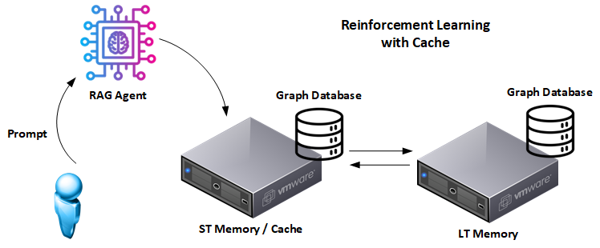

# Graph‑Based RAG: Better Option for AI Governance

Welcome to the **Graph RAG Guide**... a dual‑memory, knowledge‑graph approach to Retrieval‑Augmented Generation (RAG) that delivers answers that are faster, clearer, and governed by design. The repo houses two fully working paths:

- **Community / Open‑Source Version** - a self‑contained demo you can run on a laptop.
- **Enterprise Version** - a production‑grade variant that layers in Kafka CDC pipelines, NetApp FlexCache, SnapMirror, and other operational muscle.



By storing knowledge as **nodes & relationships** instead of opaque vectors, the agent gains traceability, reduces hallucinations, and meets demanding audit requirements.

### Project Purpose

This project was developed to address significant limitations inherent in traditional vector-based RAG solutions. Specifically:

- **Performance Shortfalls**: Traditional vector-based RAG, although effective at handling vast unstructured data, often suffers from performance bottlenecks and reduced efficiency during multi-step reasoning tasks. Graph-based RAG, complemented by optimized caching and storage layers, bridges this gap.
- **Transparency and Explainability**: Vector embeddings are inherently opaque, limiting interpretability and traceability. Graph-based RAG explicitly stores relationships between entities, significantly improving transparency, governance, and auditability.

Key objectives include:

- Provide a reference architecture for **graph‑based RAG** with explicit short‑term (cache) and long‑term (authoritative) memory.
- Demonstrate how reinforcement‑learning signals can promote proven facts from cache to durable storage.
- Show upgrade paths... from a minimal Python/RAM‑disk demo to an enterprise pipeline with exactly‑once Kafka connectors and enterprise storage.

## Benefits Over Vector-Based RAG

Adopting graph-based RAG addresses several key limitations of traditional RAG Agents:

- **Multi-Hop Reasoning**: Graph databases naturally support complex queries involving multiple related entities, enhancing retrieval accuracy.
- **Bias Mitigation**: Explicitly structured relationships simplify detection and correction of biased data.
- **Improved Compliance and Governance**: Detailed provenance and transparent data relationships facilitate auditability and regulatory compliance.
- **Risk Management**: Significantly reduced hallucinations due to verified and structured context.

### Community vs Enterprise - What Changes?

| Capability                 | Community Edition                               | Enterprise Edition                                                                |
| -------------------------- | ----------------------------------------------- | --------------------------------------------------------------------------------- |
| **Data movement**          | Python helper scripts copy sub‑graphs on demand | **Kafka Connect** Source + Sink connectors stream CDC events between Neo4j tiers  |
| **Cache backing store**    | `tmpfs` / RAM‑disk on the dev box               | **NetApp FlexCache** for NVMe‑speed reads; resiliency via **SnapMirror** replicas |
| **Operational guarantees** | At‑least‑once copies; manual scripts            | Exactly‑once semantics, replay, and audit via Kafka offsets                       |
| **Governance hooks**       | Basic provenance tags                           | Promotion events logged, schema‑versioned, and instantly traceable                |
| **Performance**            | Millisecond‑level on warm RAM cache             | Sub‑50 ms at global scale; hot blocks auto‑evicted by FlexCache                   |

> **TL;DR:** start with the community guide for laptops; switch to the enterprise path when you need 24×7, multi‑site, or compliance.

## Where To Dive Deeper

| Document                                      | What it covers                                                                                    |
| --------------------------------------------- | ------------------------------------------------------------------------------------------------- |
| **Knowledge Graphs for Better AI Governance** | Vision & business case for graph‑based RAG [link](./Knowledge_Graphs_for_Better_AI_Governance.md) |
| **Community Version Guide**            | Step‑by‑step setup for the open‑source flavour [link](./OSS_Community_Version.md)          |
| **Community README**                          | Hands‑on commands & scripts [link](./community_version/README.md)                          |
| **Enterprise Version Guide**           | Deep dive on Kafka CDC, FlexCache, SnapMirror [link](./Enterprise_Version.md)              |
| **Enterprise README**                         | Production deployment notes [link](./enterprise_version/README.md)                         |
| **Benchmark Discussion**                      | Discussion on benchmarks for Community Version [link](./OSS_Community_Benchmarks.md)                         |

## Quick Start

```bash
# 1. Clone the repo
$ git clone https://github.com/<your‑org>/graph‑rag‑guide.git

# 2. Pick your path
$ cd graph‑rag‑guide/community_version   # laptop demo
# or
$ cd graph‑rag‑guide/enterprise_version  # prod‑ready setup

# 3. Follow the README in that folder
```

Questions? Open an issue or start a discussion... contributions are welcome!
